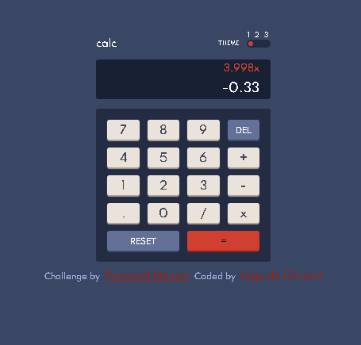
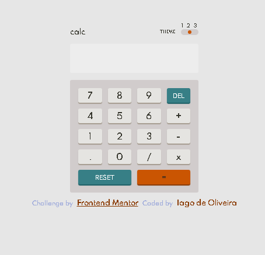

# Frontend Mentor - Calculator app solution

This is a solution to the [Calculator app challenge on Frontend Mentor](https://www.frontendmentor.io/challenges/calculator-app-9lteq5N29). Frontend Mentor challenges help you improve your coding skills by building realistic projects. 

## Table of contents

- [Overview](#overview)
  - [The challenge](#the-challenge)
  - [Screenshot](#screenshot)
- [My process](#my-process)
  - [Built with](#built-with)
  - [What I learned](#what-i-learned)
  - [Continued development](#continued-development)
  - [Useful resources](#useful-resources)
- [Author](#author)
- [Acknowledgments](#acknowledgments)

## Overview

### The challenge

Users should be able to:

- See the size of the elements adjust based on their device's screen size
- Perform mathmatical operations like addition, subtraction, multiplication, and division
- Adjust the color theme based on their preference
- **Bonus**: Have their initial theme preference checked using `prefers-color-scheme` and have any additional changes saved in the browser

### Screenshot

## My process

### Built with

- Semantic HTML5 markup
- CSS custom properties
- CSS Grid
- Flexbox
- JavaScript

### What I learned

One of the main things that I learned was that JavaScript is really bad at math. I had to put an extra effort trying to get around it. Other thing was that trying to finish a project 100% is harder then doing 80%/90% of it. Making your code cleaner and with less bugs as possible is not an easy task, even if your project is not that complex.

### Continued development

I intend to redo this project and do others projects in the future using classes/objects instead of only using functions. This is a step foward I'll try and achieve that would enven benefit any further MVC structure that I try to implement.

### Useful resources

- [prefers-color-scheme](https://developer.mozilla.org/pt-BR/docs/Web/CSS/@media/prefers-color-scheme) - This article was my first contact with this media feature and helped me to get a good grasp of it. 

## Author

- Website - [Iago D. de Oliveira Marques](https://github.com/IagodeOliveira/)
- Frontend Mentor - [@IagodeOliveira](https://www.frontendmentor.io/profile/IagodeOliveira)

## Acknowledgments

Got some inspiration for the calculator's screen design from Web Dev Simplified Youtube channel.
- The Link to the video - (https://www.youtube.com/watch?v=j59qQ7YWLxw)
